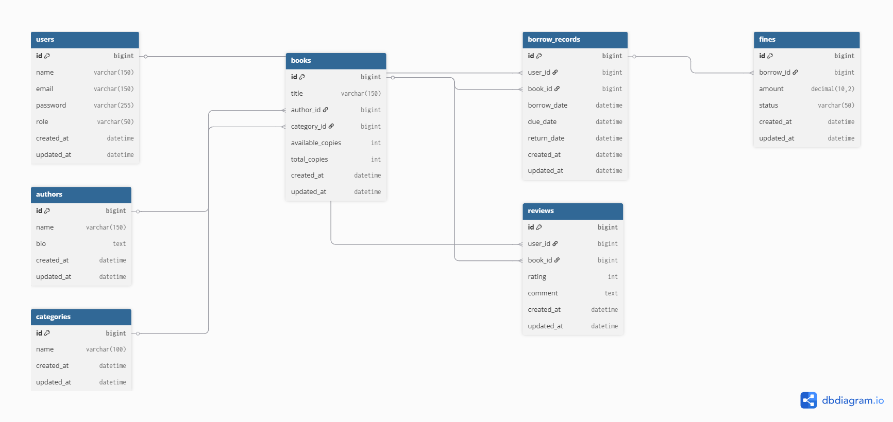

📚 Library Management System
🔹 Overview

A full-featured Library Management System built with Laravel, designed for both Admins and Members.
It supports book management, borrowing/returning, categories, authors, and reviews with role-based access control.

✨ Features

👨‍💻 Admin Panel: Manage books, categories, and authors.

📖 Member Access: Browse books, borrow and return copies.

🔐 Role-based authentication (Admin & Member).

📊 Borrow records and availability tracking.

🌐 RESTful API endpoints for external integrations.

📝 Reviews system for members to rate and review books.

🔹 Tech Stack

Backend: Laravel 10, PHP 8+

Database: MySQL / PostgreSQL

Frontend: Blade (Bootstrap 5)

Authentication: Laravel Breeze

API Security: Laravel Sanctum

Testing: PHPUnit / Pest

🔹 Database ERD

